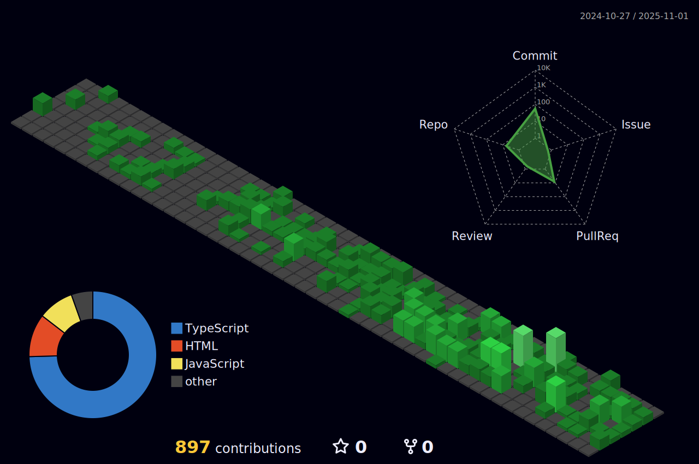

## Sobre

Sou desenvolvedor com foco em Front-End, onde acredito que me encontrei, minha maior especialização vai para o Framework Angular, porém sempre estou de olho em técnologias como react e sua rica comunidade, adoro procurar novas bibliotecas e soluções novas que buscam facilitar a vida do programador.

&nbsp;

## Minhas habilidades

#### Frameworks / Bibliotecas:

#### Linguagens:

#### Bancos de dados:

#### Sistemas operacionais:

#### Ferramentas de trabalho:

#### Gerenciadores de pacote:

